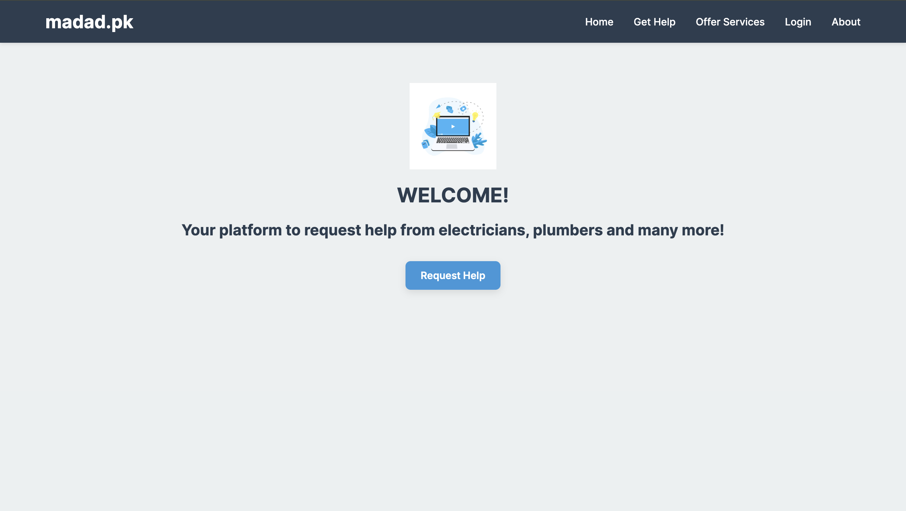
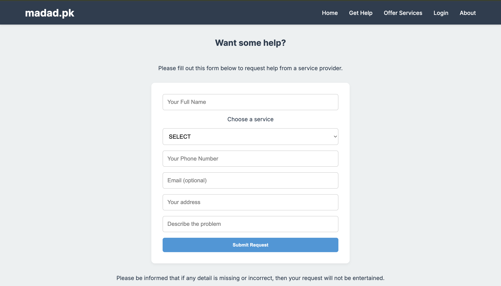

# madad.pk 

**madad.pk** is a web platform designed to connect people in Pakistan with **trusted local service providers** like electricians, plumbers, mechanics, and more.

Built with the goal of empowering communities and solving real-world problems using technology.

---

## Motivation

Many people in Pakistan struggle to find **reliable, verified help** for everyday tasks. madad.pk was created to:

- Reduce the hassle of finding skilled service providers
- Build trust through verified listings and reviews
- Encourage local employment and entrepreneurship

---

## Features

✅ Find nearby service providers  
✅ Contact verified electricians, plumbers, mechanics, etc.  
✅ Clean and responsive user interface  
✅ (Future) Ratings and reviews system  
✅ (Future) Location-based filtering and user authentication

---

## Tech Stack

- **Frontend**: HTML, CSS, JavaScript  
- **Backend**: Flask (Python)
- **Database**: MySQL

---

## Screenshots

---

## Current Status

> Completed. Fully Functional Prototype with Core Features Built and Tested 
Next goals:
- Hook up backend functionality
- Add basic authentication and filtering features (location, review based)
- Adding ratings for service providers

---

## Additional Notes

Parts of this project were supported using AI tools (e.g., ChatGPT) for:

- Structuring code
- Debugging
- Design Suggestions
- Documentation

All final decisions, design choices, and implementations were made independently.

## Made By

[Asad Hasan Alvi](https://github.com/asadhasanalvi) – Aspiring CS Major  
> Passionate about building tools that solve real problems and create social impact.

---
